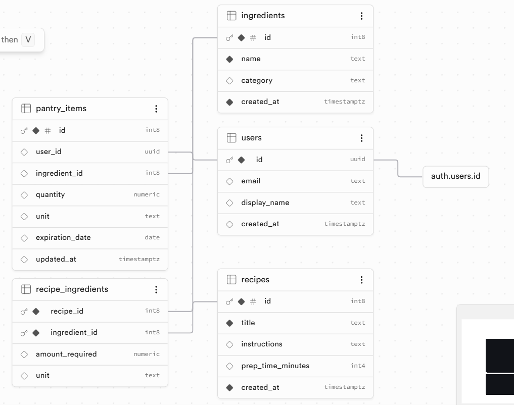

# FridgeMatch 🍎

### סקירה כללית
**FridgeMatch** הוא עוזר חכם לניהול המקרר והמזווה, שעוזר למשתמשים למצוא מתכונים יצירתיים המבוססים על המרכיבים שכבר יש להם בבית.

### הבעיה שאנו פותרים
אנשים רבים מוצאים את עצמם זורקים אוכל שנשכח במקרר או מתלבטים "מה אפשר להכין לאכול" כשאין להם כוח ללכת לסופר. הפרויקט פותר את "כאב" בזבוז המזון וקבלת החלטות מהירה בארוחות.

### קהל היעד
סטודנטים, אנשים עסוקים או משפחות שרוצות למקסם את המלאי הקיים, לחסוך כסף ולהפחית בזבוז מזון על ידי ארוחות ספונטניות ומהירות.

### מתחרים ובידול
* **המתחרים:** חיפוש ידני בגוגל, אפליקציות מתכונים גנריות, או "ניחוש" במקרר.
* **הבידול:** בניגוד לאתרים המציעים מתכונים ללא התחשבות במה שיש למשתמש בבית, FridgeMatch מתחיל מהמלאי האישי של המשתמש ומציע פתרון מיידי למוצרים הקיימים.

### 🔗 פרויקט חי
* **לינק לפרויקט ב-Vercel:** [כאן להוסיף לינק]

---

### 📊 מודל נתונים (ERD)
הארכיטקטורה הטכנית מבוססת על בסיס נתונים רלציוני ב-Supabase:

**הסבר על המודל:**
הארכיטקטורה בנויה על הפרדה בין ישויות המשתמשים, מלאי המזווה (`pantry_items`) והמתכונים, תוך שימוש בטבלה מקשרת (`recipe_ingredients`) המאפשרת יחסים מורכבים בין מרכיבים למתכונים. המבנה מבטיח שליפה מהירה של תוצאות רלוונטיות על בסיס רשימת המלאי האישית של כל משתמש.

---

### 🛠 שירותים חיצוניים ואינטגרציות

| שירות | סוג | תפקיד במוצר |
| :--- | :--- | :--- |
| **Google OAuth** | אוטנטיקציה | התחברות משתמשים בצורה מאובטחת ומהירה באמצעות חשבון גוגל. |
| **Supabase Database** | מסד נתונים | ניהול ואחסון נתוני המשתמשים, המזווה והמתכונים השמורים. |
| **OpenAI API** | קריאת API | ניתוח מרכיבי המזווה ויצירת הצעות חכמות למתכונים. |
| **Supabase Edge Functions** | לוגיקת שרת | הרצת קוד צד-שרת מאובטח לביצוע קריאות ל-API של OpenAI. |
| **Vercel** | Deployment | אירוח האתר והנגשתו למשתמשי קצה כגרסה חיה. |